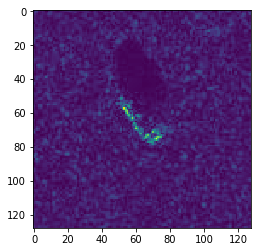

# ATR-FNN
Automatic Target Recognition using Fuzzy Neural Networks

---
In this implementation we have done comparative study of 2 kinds of neural networks for a multi class-classification task.

**Data set used** - MSTAR SAR DATA

---
**The unreasonably superior capabilities of MAMs**

MAMs have the capabilities of recalling images even on high erosion and dialtion, losses as great as almost 50% and can be recalled at 0% loss.

Original Image   | Eroded image  | Reconstructed image|
:--------------------:|:-------------------:|:----------------------------:
  | |          |

You can see the code implementation in MAMs discussion.ipynb- 

------------------------

**Constraints** -

Generally we need lots of high quality data for neural nets to do a pretty good job on classification but what if you wanted to do classification on data that was -
1. Highly noisy
2. Very small in size (here around 1000 samples)

Exact details - 

|MODEL | TRAIN  | VALIDATION |TEST |   
| -------- | -------   |  -------------- | -------|
 |    MLP | 696      |    174           | 408   | 
 |    DMN | 870     |    -          | 408   | 
 
      
I was really skeptic of results this morphological model will get because I could never imagine it could perform this good given the constraints. So the results I got by running this dataset on DMN and an MLP are  as follows - 

|MODEL | TRAIN   |TEST |   
| -------- | -------    |-------|
 |    MLP | 33%      |    33%| 
 |    DMN | 100%     | 71.57% | 
 
I am pretty sure this can be made better which will be done in my forthcoming work. Also fuzzyfication of MAMs would be my next job in order to make it noise tolerant. Please take a look at the MLP model.ipynb here and DCpretraining.m inside the DMN_SGD for DMN implementation.

Tested in -

OS - Ubuntu 16.04

Intel core-i7 5500U

8GB RAM

**Installation instructions**-

Python3 -
``pip3 install -r requirements.txt``

Python2 -
``pip install -r requirements.txt``

**Acknowledgement** - 
I would like to thank Erik Zamora for his code on DMNs. 

**Primary papers used for reference -**

 	http://ieeexplore.ieee.org/document/5478256/
 	http://ieeexplore.ieee.org/document/7849933/
 	
 **Research papers by G.X Ritter and Sussner some of them include** - 

	https://link.springer.com/article/10.1023/A:1024773330134
	https://www.researchgate.net/publication/5600742_Morphological_associative_memories
	http://ieeexplore.ieee.org/document/1681716/

**Some additional resources** - 

 	http://www.dca.fee.unicamp.br/~gudwin/ftp/publications/enia01.pdf
	http://etd.fcla.edu/UF/UFE0010050/iancu_l.pdf
